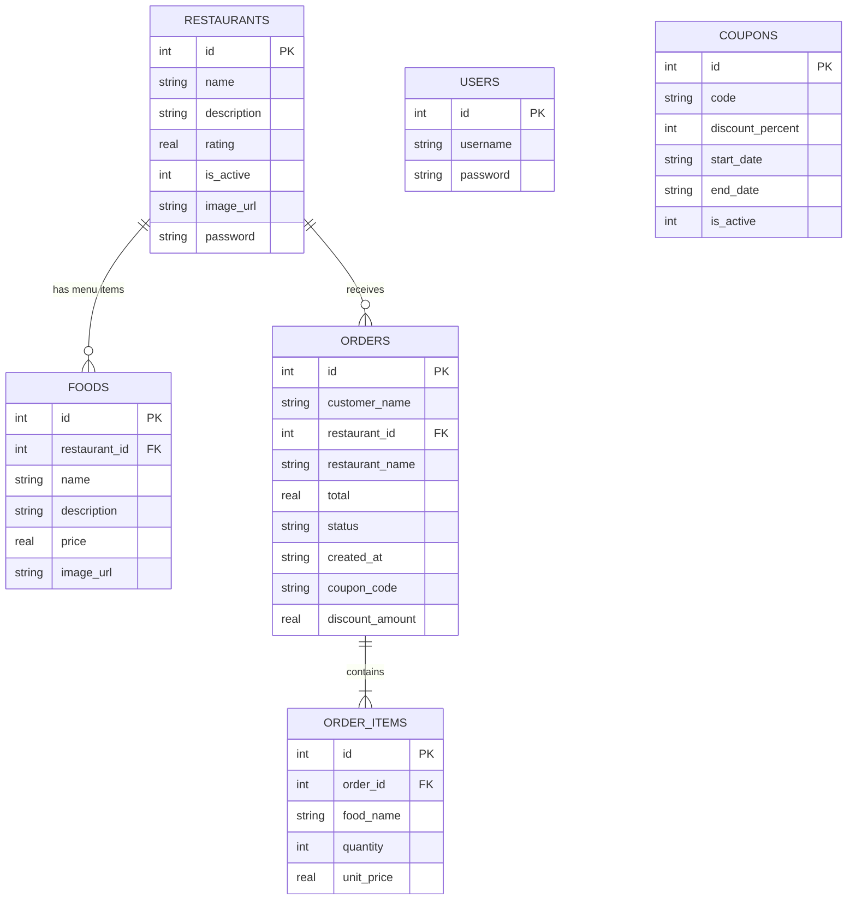

# 🍔 QuickBite

A JavaFX desktop food-ordering application built for a university project, inspired by
FoodPanda-style apps and built with traditional Java, JavaFX and SQLite.


This README is organised around the project's grading rubric: each numbered section answers
one rubric item, with file paths so it can be checked quickly.

## Features

**Customer:** register and log in with a real account (password-strength checked), browse and
search restaurants and menus, see a picture for every dish, add to cart, apply a time-limited
coupon, place orders, watch delivery status update automatically, get desktop notifications,
view order history, "Pick a Dish for Me" (a random dish from the menus), and nutrition facts
for any dish from the USDA FoodData Central API. Ordering is blocked, with a red banner, while offline.

**Restaurant:** log in with a password the admin set for that restaurant; see incoming,
in-progress and completed orders live; accept or reject orders.

**Admin:** log in through the same screen as restaurants (choose "Administrator"). Add, edit,
delete and whitelist/blacklist restaurants (each with its own login password); manage menus;
bulk-add many restaurants and foods from pasted text; manage coupons with date ranges; watch
every order live; and reset all data.

## Contents

1. [Version Control](#1-version-control)
2. [Advanced OOP Concepts](#2-advanced-oop-concepts)
3. [JavaFX UI Design](#3-javafx-ui-design)
4. [Layout Responsiveness](#4-layout-responsiveness)
5. [Concurrency](#5-concurrency)
6. [Database Integration](#6-database-integration)
7. [Data Manipulation (CRUD)](#7-data-manipulation-crud)
8. [Networking & Data Parsing](#8-networking--data-parsing)
9. [Getting Started](#9-getting-started)
10. [Project Structure](#10-project-structure)

---

## 1. Version Control

Developed with incremental commits using a `feat:` / `fix:` / `style:` / `docs:` convention
(see `git log`). [`GIT_WORKFLOW.md`](GIT_WORKFLOW.md) documents the branching model with a worked
example: create a branch, make conflicting changes on both branches, merge, resolve the
conflict, and push.

> The commit history in this repository is the real one. Timestamps have not been altered.

---

## 2. Advanced OOP Concepts

| Concept | Where |
|---|---|
| **Abstract class** | `dao/BaseDao<T>` declares an abstract `findAll()` and shares a `connection()` helper. Extended by `RestaurantDAO`, `OrderDAO`, `CouponDAO`, `UserDAO`. |
| **Interface** | `service/Shutdownable`, implemented by `OrderTrackingService`, `ApiService`, `NetworkMonitor`. `QuickBiteApp.stop()` shuts them all down through a `List<Shutdownable>`. |
| **Interface + polymorphism** | `model/Discountable`, implemented by `Coupon`. `OrderService` only calls `discountFor(subtotal)`. |
| **Generics** | `BaseDao<T>` |
| **Enum with behaviour** | `model/OrderStatus` (`next()`, `isFinished()`, `mainSequence()`) is the delivery state machine. |
| **Records** | `BulkImportParser.ParsedFood`, `BulkImportParser.Result` |
| **Encapsulation and composition** | Immutable models; `Restaurant` owns `FoodItem`s, `Order` owns `OrderItem`s. Restaurant passwords are deliberately kept out of the `Restaurant` model. |
| **Design patterns** | Singleton (`OrderTrackingService`, `ApiService`, `NetworkMonitor`); Observer (listener lists on those services). |

---

## 3. JavaFX UI Design

| Category | Used | Where |
|---|---|---|
| Layout panes | `BorderPane` | every main screen |
| | `StackPane` | login / register (card over a background image) |
| | `VBox`, `HBox`, `GridPane`, `ScrollPane`, `TabPane` | throughout; `GridPane` in admin dialogs, `TabPane` in admin |
| Input | `TextField`, `TextArea`, `PasswordField`, `ComboBox`, `Spinner`, `DatePicker`, `Hyperlink`, `Tooltip` | login, register, admin forms, cart, nutrition button |
| Display | `TableView` / `TableColumn`, `ImageView`, `Label` with graphics | order history, admin tabs, food cards |
| Dialogs | `Alert`, `Dialog<ButtonType>`, `TextInputDialog` | confirmations, admin CRUD, reset confirmation |
| Icons / styling | Ikonli `FontIcon`, JavaFX CSS with colour variables | `css/quickbite.css` |

---

## 4. Layout Responsiveness

- **Container-based:** the `BorderPane` centre fills leftover space; `HBox.hgrow` / `VBox.vgrow`,
  `ScrollPane fitToWidth`, and `TableView.CONSTRAINED_RESIZE_POLICY_FLEX_LAST_COLUMN` let content
  share the available space.
- **Property binding to window size** (`RestaurantController.initialize()`):

```java
sidePanel.prefWidthProperty().bind(Bindings.max(260, Bindings.min(420, rootPane.widthProperty().multiply(0.25))));
```

The sidebar is always 25% of the window width, clamped between 260 and 420 px, and updates
live as the window is resized. `widthProperty()` is a live property, so no resize listener is needed.

---

## 5. Concurrency

| Service | Pool | What runs in the background |
|---|---|---|
| `OrderTrackingService` | `ScheduledExecutorService`, 2 threads (`order-tracker-N`) | Advances accepted orders through delivery stages after a random delay and saves each change |
| `ApiService` | `ExecutorService`, 2 threads (`api-worker`) | The USDA `HttpClient` call and JSON parsing |
| `NetworkMonitor` | `ScheduledExecutorService`, 1 thread (`network-monitor`) | Connectivity check every 4 seconds that drives the offline banner |

All pools use daemon threads with named `ThreadFactory`s and are shut down in
`QuickBiteApp.stop()` via the `Shutdownable` interface. Results return to the UI with
`Platform.runLater(...)`; `Order.status` is `volatile`; listener lists are `CopyOnWriteArrayList`.

---

## 6. Database Integration

SQLite via JDBC (`database/DatabaseManager`, `database/DatabaseInitializer`). Tables are created
on first run, older files are migrated with `ALTER TABLE ... ADD COLUMN` guarded by
`PRAGMA table_info`, and sample data is seeded once (`PRAGMA user_version`).



`foods` and `order_items` use `ON DELETE CASCADE`; `PRAGMA foreign_keys = ON` is set on every
connection; every query is a `PreparedStatement`. `users` and `coupons` are looked up by
username / code rather than by foreign key.

---

## 7. Data Manipulation (CRUD)

| Entity | Create | Read | Update | Delete |
|---|---|---|---|---|
| Restaurant | `RestaurantDAO.insert` (Admin → Add Restaurant, or Bulk Add) | `findAll`, `findAllIncludingInactive` | `update`, `setActive`, `setPassword` | `delete` |
| Food | `FoodDAO.insert` (or Bulk Add) | `findByRestaurant` | `update` | `delete` |
| Coupon | `CouponDAO.insert` | `findAll`, `findByCode` | `update`, `setActive` | `delete` |
| Order | `OrderDAO.insertOrder` | `findByCustomer`, `findByRestaurant`, `findAll` | `updateStatus` | via Reset All Data |
| User | `UserDAO.register` | `findByUsername`, `findAll` | n/a | via Reset All Data |

**Bulk Add** (`util/BulkImportParser`, `dao/AdminDAO.bulkImport`) saves many restaurants and foods
in one transaction. Paste lines like this:

```
RESTAURANT: Kebab Corner | Grilled kebabs and rolls | 4.5 | kebab123
Seekh Kebab | Minced beef skewers | 220
Chicken Roll | Paratha roll with chicken | 150 | chicken_roll.jpg
```

**Reset All Data** (`AdminDAO.resetAllData`) empties every table in one transaction and leaves
the admin login untouched, because it is not stored in the database.

---

## 8. Networking & Data Parsing

"Nutrition facts" (the ⓘ button on each dish) calls the **USDA FoodData Central** API from
`api/ApiService.java`:

```
ⓘ click → ApiService.fetchNutrition() → ExecutorService ("api-worker")
        → HttpClient GET https://api.nal.usda.gov/fdc/v1/foods/search?query=<dish>&api_key=...
        → JSON text → Jackson ObjectMapper.readValue(json, FdcSearchResponse.class)
        → FdcSearchResponse → FdcFood → List<FdcNutrient>
        → NutritionInfo.fromFood(...) → Platform.runLater(...) → dialog on the JavaFX thread
```

- **HTTP:** the JDK's `java.net.http.HttpClient`.
- **JSON parsing:** Jackson maps the response onto `FdcSearchResponse` / `FdcFood` / `FdcNutrient`
  (`@JsonProperty`, `@JsonIgnoreProperties(ignoreUnknown = true)`). `NutritionInfo.fromFood` then
  picks calories, protein, fat, carbs, sugars, fibre and sodium by USDA nutrient number.
  `NutritionInfoTest` parses a sample response in a unit test.
- **Failure handling:** timeouts, no network, a bad key (401/403), the rate limit (429) and "no match"
  each produce a plain-English message; nothing else in the app depends on the API.
- **API key:** never committed. Set the `USDA_API_KEY` environment variable, or create a
  git-ignored `quickbite.properties` file containing `usda.api.key=YOUR_KEY`. Without either, the
  shared `DEMO_KEY` is used (heavily rate-limited). Get a free key at
  <https://fdc.nal.usda.gov/api-key-signup.html>.

---